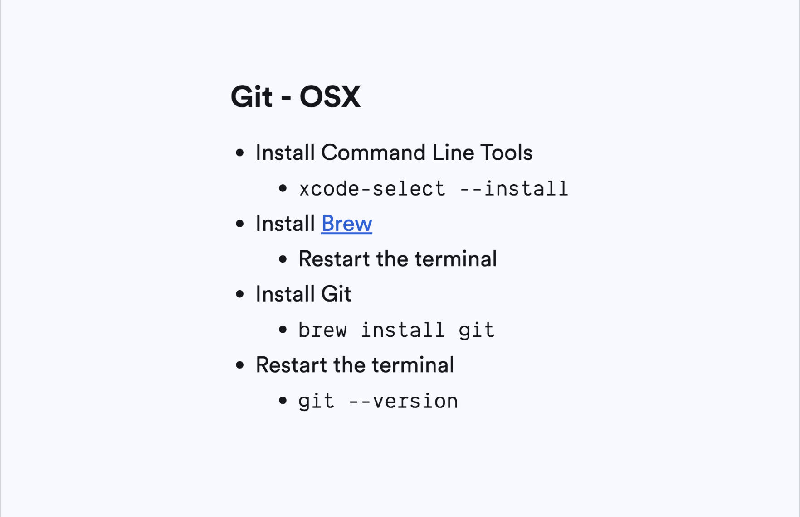
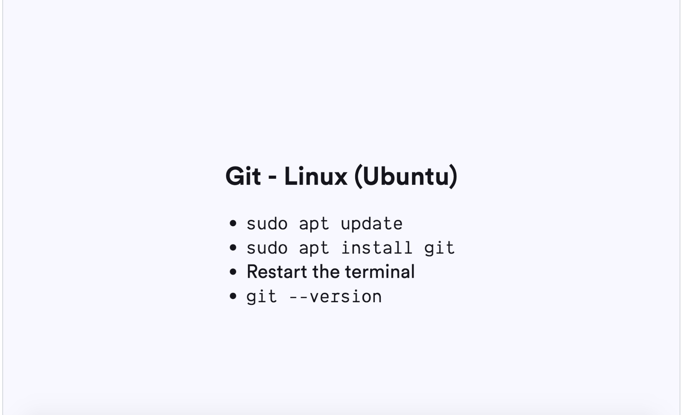
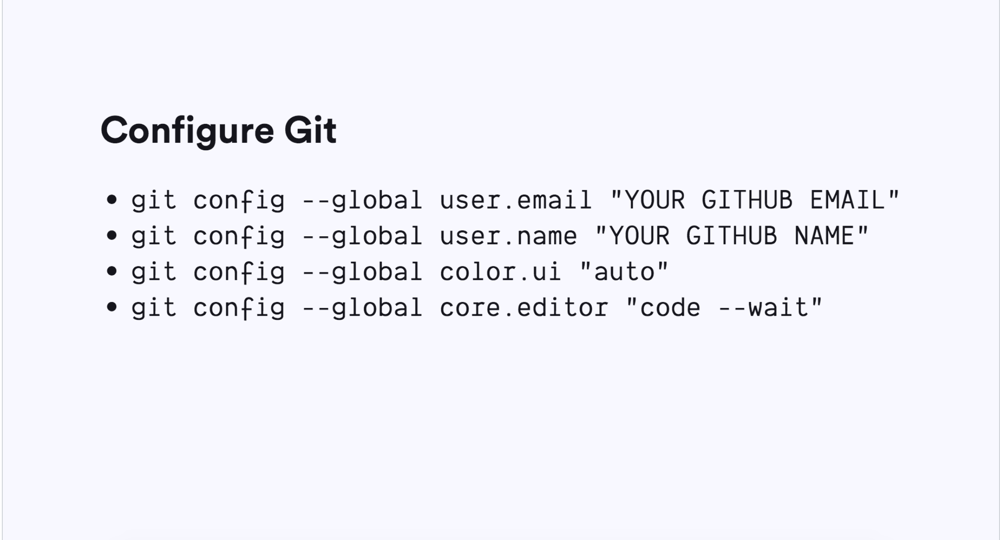
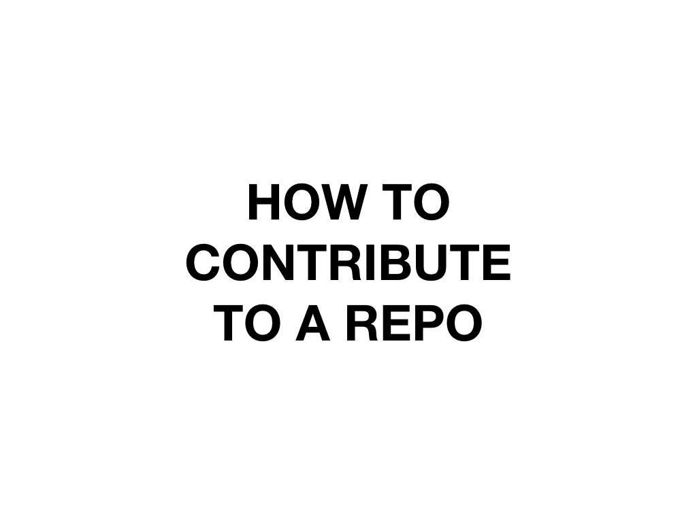
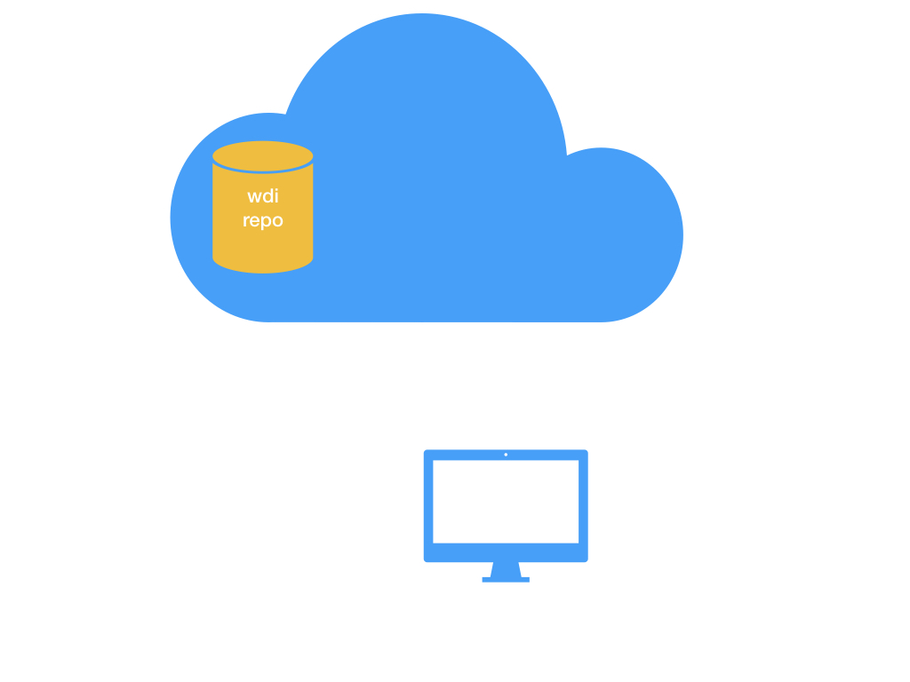
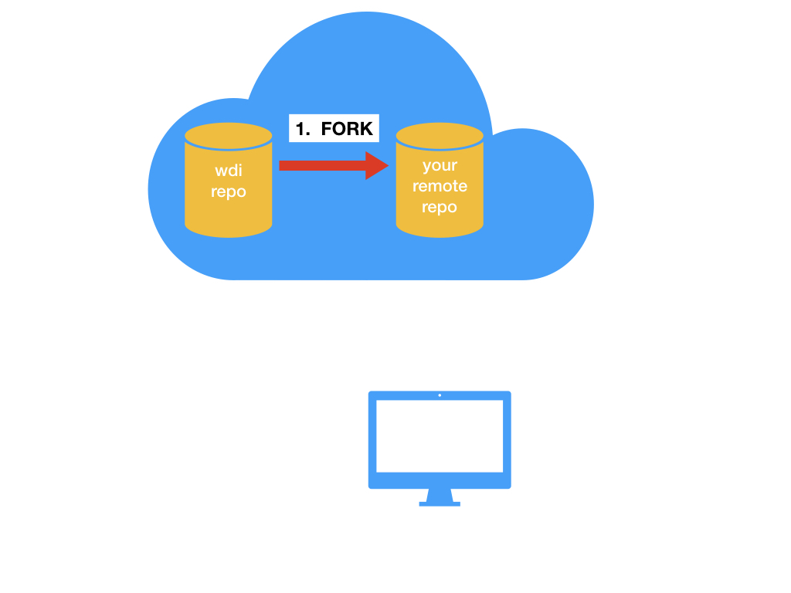
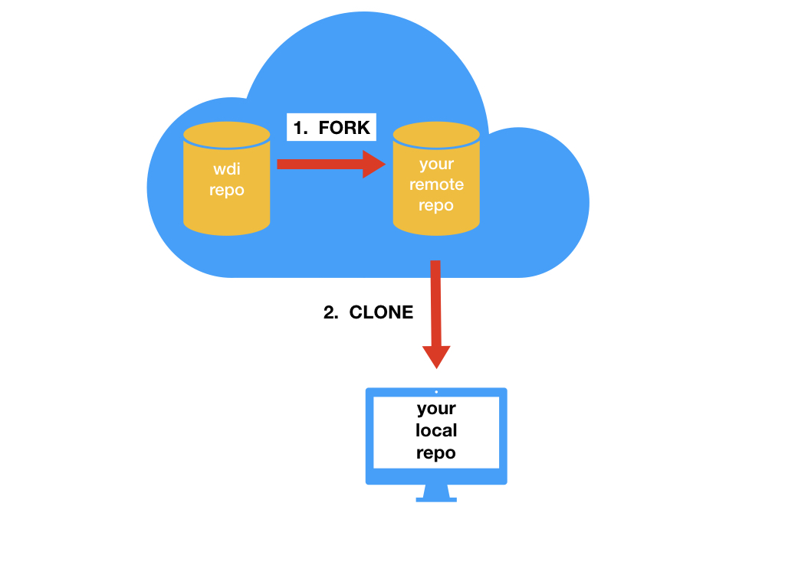
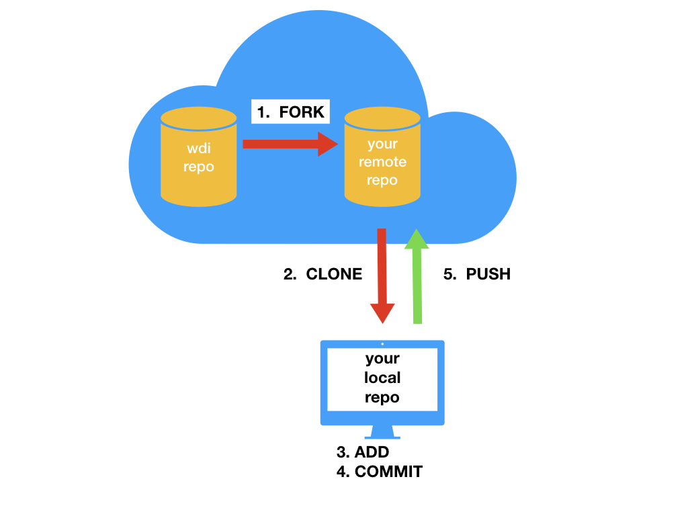
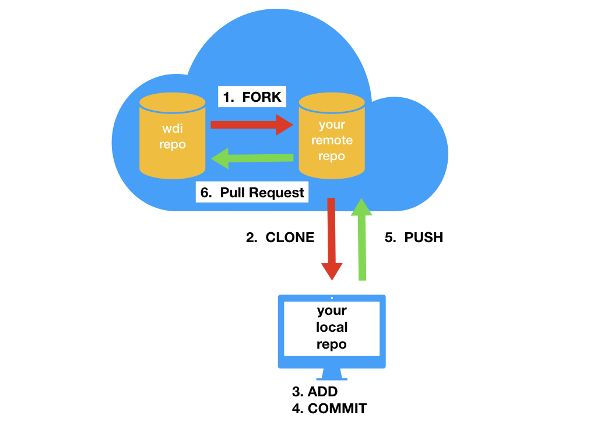

[](https://generalassemb.ly/education/web-development-immersive)

# Git Basics

## Objectives

- Initialize a git repository in order to track changes.
- Create a new branch to isolate your changes.
- Place new or changed files into the staging area to prepare them for a
  commit.
- Remove files from the staging area before a commit.
- Commit new and changed files to a git repository.

## Why Git

Version control! As developers our code is our livelihood so it's important
that we safely store our work... frequently.  Not only that, we also want to
track our changes as we make them.  If we make a feature that ends up breaking
the rest of our app we want to be able to go back to a point when our app was
last working.







## Code Along: Making a Local Repository

Let's initialize a local repository.

1. In your training directory, NOT the directory you just cloned, create a
    subdirectory called `<your-name>s-game-of-gits`. So if your name is Kyrie,
    it should be called `kyries-game-of-gits`.

1. Inside of the `<your-name>s-game-of-gits` directory create a file called `sad-tale.md`.

1. Open the file with VSCode and copy in the following lines:

  ```
  House Stark of Winterfell is led by the just Eddard "Ned" Stark, Lord of
  Winterfell, Warden of the North, Hand of the King, Protector of the Realm,
  Regent.  He is surely honorable and will lead a long and prosperous life.
  ```

1. Save the file.

1. Inside of the `<your-name>s-game-of-gits` directory type `git status`. Did anything
   happen?

1. Again, inside the `<your-name>s-game-of-gits` directory type `git init`.

1. Type `git status` again. Did anything happen this time?

## Code Along: Staging and Commiting

Using `git add <name-of-file>` we are going to add our story to the staging
area.

There are 3 states that your file can reside in `modified`, `staged`, and
`committed`.  These states map to the different sections of a Git project.

- Modified means that you have changed the file but have not committed it to
  your git repository yet.
- Staged means that you have marked a modified file in its current version
  to go into your next commit snapshot.
- Committed means that the data is safely stored in your local git repository.

[Git Basics](https://git-scm.com/book/en/v2/Getting-Started-Git-Basics)


When we add a file we are moving it from the working directory to the staging
area.

Now that our file is staged let's commit our file by typing `git commit`, VSCode
should open. You may have seen `git commit -m <commit message>` used to commit
with an inline commit message. In most cases, we prefer to use `git commit`,
which allows us to write a longer and more meaningful commit message.

When you use -m to create an inline commit you are only able to leave a small
amount of information with your commit. This can potentially lead to poor
understandably of your commit due to the short nature of inline commits, and
the lack of a body description to it.

## Lab: Crafting A Commit

Read over the following blog posts and carefully think about what a good commit
message would be. Take some time to come up with your own. Be ready to share
your commit with the rest of the class.

- [What's in a Good Commit?](http://dev.solita.fi/2013/07/04/whats-in-a-good-commit.html)
- [A Note About Git Commit Messages](http://tbaggery.com/2008/04/19/a-note-about-git-commit-messages.html)

Now that we've made our first commit, let's see what happens when we type `git
log`... We see our previous commit! This typically shows all of our previous
commits, but since we just have one, that's all we see. Feel free to play around
with options for `git log`, like `--oneline`, `--name-status`, and `--relative-date`
for example. For all options [click here.](https://git-scm.com/docs/git-log)

## Staging: And He Lived Happily After

Together, let's continue our story.

In our `sad-tale.md`, we'll tell the rest of Ned Stark's story.  Paste this in
below our current description and save:

```
Ned Stark went to King's landing where he made lots of friends and lived
happily ever after...  He definitely didn't get axe murdered.
```

Now using what we learned earlier stage this change. To figure out the status
of your files you can type `git status` in the terminal at any time.

**Remember: Staging isn't committing**

## Unstaging: Maybe We Jumped the Gun

It turns out Ned actually did get axe murdered. So we probably want to unstage
our file.

Unstage the file with `git reset <filename>`

Delete the last thing we wrote in `sad-tale.md`.

## Removing: Deleting Staged Files

Let's practice removing files after they have been staged.

### Using The Bash `rm` Command

1. Inside of `<your-name>s-game-of-gits` create a file called `the-stark-bunch.md`.

1. Open the file with VSCode and copy in the following lines:

  ```
  This is a story... of a man named Neddy... and three very badass really
  awesome girls
  ```

1. Save the file.

1. `git add the-stark-bunch.md`.

1. `rm the-stark-bunch.md`.

1. `git status`

What do you see? The addition of `the-stark-bunch.md` is still staged as a `new file` type change, however, there is an unstaged `deleted` type change. You have to run an additional command to unstage the `new file ` change.

7. `git reset -- the-stark-bunch.md`.

### Using The `git rm` Command

1. Inside of `<your-name>s-game-of-gits` create a file called `the-stark-bunch.md`.

1. Open the file with VSCode and copy in the following lines:

  ```
  This is a story... of a family
  ```

1. Save the file.

1. `git add the-stark-bunch.md`.

1. `git rm -f the-stark-bunch.md`.

1. `git status`

What's the difference between `git rm` and `rm`? What is actually happening with the `git rm` command?


## Branching: Multiple Stories, One Main Plot

Looking back, we know that Ned's story doesn't have a happy ending but let's
dream big.  We're going to create a dream-story branch and write what we would
have wanted to happen.

Similar to having one main story and various sub-plots--a branch lets us
effectively duplicate and section off the code we have written thus far, make
alterations to it, and if we would like at some point we can join it back to the
main branch (typically called `master`).

Create a branch called `dream-story` by typing `git branch dream-story`.
_You can see all your current branches at any time by typing `git branch`._

Now that we've created our branch--in order to use it we have to switch to it.
We can do this with the command `git checkout <branch-name>`.

## Lab: Branching Your Dreams

1. Switch to your `dream-story` branch and write a brief description of what
   you would have wanted to happen to Ned.

1. Save the file, Stage and commit your changes.

1. Switch back to your `master` branch. (Notice anything?) Add what really
   happened to Ned.

1. Stage and commit your changes.

(Be ready to talk about any issues you many have encountered or strange things
you may have noticed).

## Git Basic Workflow Checklist

- [ ] `git status` to confirm clean working directory
- [ ] confirm branch is correct
- [ ] make changes to `file`
- [ ] `git add 'file'`
- [ ] `git status` (to confirm modified files have been staged)
- [ ] `git commit`

# Github and Git



## Go to the repository you want to contribute to


## Fork the repository



## Clone the repository



## Add/Edit/Remove files then `git add` and `git commit` your changes


## Push your changes 



## Open a Pull Request



## Github and Git Workflow Checklist

- [ ] Fork the repository
- [ ] `git clone` the repository
- [ ] Complete your work by adding/editing files
- [ ] `git status` to confirm clean working directory
- [ ] `git add` your files
- [ ] `git status` (to confirm modified files have been staged)
- [ ] `git commit` with your message
- [ ] `git push origin master`
- [ ] open Pull Request 

# Git Best Practices

- ADD files explicitly. If you have multiple files, use full paths to refer to
  each. Example: `git add foo/bar.md baz/qux.js`
- ALWAYS use `git status` before any other command
- NO commit is too small
- NO commit message is too long
- NEVER nest repositories

## Additional Resources

- [Git Commands Cheatsheet](git-cheatsheet.md)
- [Github Git Cheat Sheet](https://services.github.com/on-demand/downloads/github-git-cheat-sheet.pdf)
- [Learn Version Control with Git](http://www.git-tower.com/learn/git/ebook)
- [Visualizing Git Commands](https://onlywei.github.io/explain-git-with-d3/)
- [Learn Git Branching](http://pcottle.github.io/learnGitBranching/)


## [License](LICENSE)

1. All content is licensed under a CC­BY­NC­SA 4.0 license.
1. All software code is licensed under GNU GPLv3. For commercial use or
   alternative licensing, please contact legal@ga.co.
